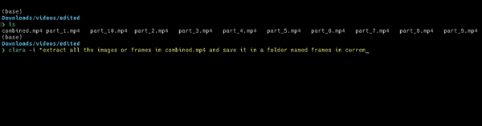

# Project Name: Clara-Term 🚀
An advanced terminal-based automation tool powered by AI – because who needs humans anymore? 🤖

## Description
Ever wished your computer could just 'get' you? Well, Clara-Term is basically a mind reader in the form of code. Powered by GPT-3.5 (with a VIP pass for GUVI-GPT and Llama2 coming soon), it's changing the game in script automation. Perfect for those who love Python 🐍 (and soon, Go and JavaScript aficionados). 

### Key Features
- **AI-Driven Script Wizardry:** Creates scripts so you don't have to. It's like magic, but real. ✨
- **Language Party:** Starts with Python, but Go and JavaScript are on the invite list. 🎉
- **Self-Healing Wizard:** It fixes its own boo-boos in scripts. Self-care at its finest. 🩹
- **Dependency Juggler:** Manages dependencies like a circus pro. 🎪
- **The Future is Bright:** Brace yourselves, GUVI-GPT and Llama2 are coming. 🌟

## Installation
```bash
python -m venv env
source env/bin/activate
pip install --editable .
```
Because who has time for complicated installations?



## Usage
```bash
nano .env
add this line --> OPENAI_ACCESS_KEY=your key

clara -i "[Your Query]"
```
Ask and you shall receive. It's like having a genie, but for code. 🧞

## Contributing
Got ideas? Improvements? Jokes? All are welcome here! Let's make coding fun again (was it ever not fun?) 😜

## Star Us! ⭐
If you like what you see, give us a star! Stars are like virtual high-fives. 🙌

## License
[Your choice, but 'MIT License' is cool if you like to keep it chill]

## Credits
GUVI (https://www.guvi.in/)
--They Bought Me Coffee ☕--
# Project Name: Clara-Term 🚀
An advanced terminal-based automation tool powered by AI – because who needs humans anymore? 🤖

## Description
Ever wished your computer could just 'get' you? Well, Clara-Term is basically a mind reader in the form of code. Powered by GPT-3.5 (with a VIP pass for GUVI-GPT and Llama2 coming soon), it's changing the game in script automation. Perfect for those who love Python 🐍 (and soon, Go and JavaScript aficionados). 

### Key Features
- **AI-Driven Script Wizardry:** Creates scripts so you don't have to. It's like magic, but real. ✨
- **Language Party:** Starts with Python, but Go and JavaScript are on the invite list. 🎉
- **Self-Healing Wizard:** It fixes its own boo-boos in scripts. Self-care at its finest. 🩹
- **Dependency Juggler:** Manages dependencies like a circus pro. 🎪
- **The Future is Bright:** Brace yourselves, GUVI-GPT and Llama2 are coming. 🌟

## Installation
```bash
python -m venv env
source env/bin/activate
pip install --editable .
```
Because who has time for complicated installations?


## Usage
```bash
nano .env
add this line --> OPENAI_API_KEY=your key

clara -i "[Your Query]"
```
Ask and you shall receive. It's like having a genie, but for code. 🧞

## Contributing
Got ideas? Improvements? Jokes? All are welcome here! Let's make coding fun again (was it ever not fun?) 😜

## Star Us! ⭐
If you like what you see, give us a star! Stars are like virtual high-fives. 🙌

## License
[Your choice, but 'MIT License' is cool if you like to keep it chill]

## Credits
G4F (https://github.com/xtekky/gpt4free)
Offline Support

GUVI Geek Network Pvt. Ltd. (https://www.guvi.in/)

